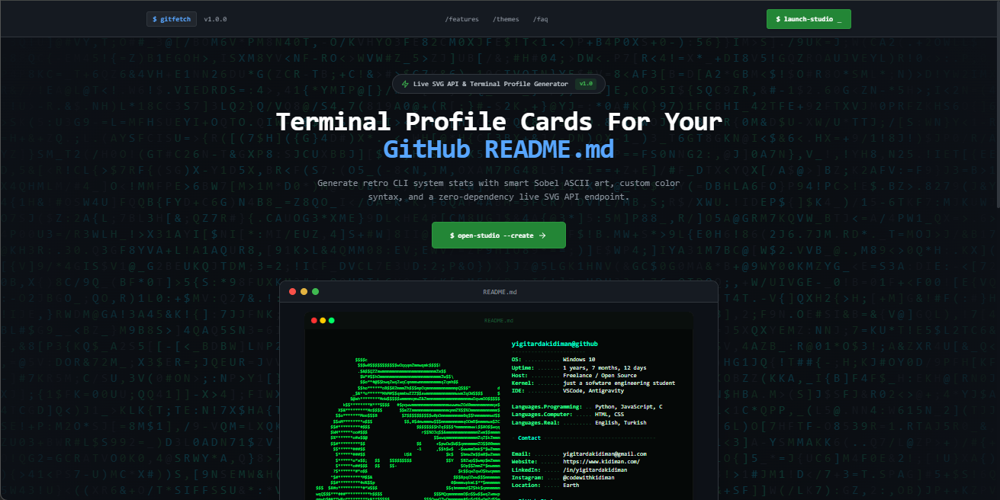

<div align="center">

# ⌨️ GitFetch — GitHub README'niz İçin Terminal Profil Kartları

**Akıllı Sobel ASCII art, özelleştirilebilir renk temaları ve sıfır bağımlılıklı canlı SVG API ile retro terminal tarzı profil kartları oluşturun.**

[](https://nextjs.org/)
[](https://tailwindcss.com/)
[](LICENSE)
[](https://vercel.com/)

**🇬🇧 [Click here for English version](#english-version)**

<br />



<br />

</div>

---

## 🔍 GitFetch Nedir?

GitFetch, GitHub profil fotoğrafınızı **ASCII art'a** dönüştürür ve tamamen özelleştirilebilir bir **neofetch tarzı** terminal kartıyla birleştirir. Sonuç, `README.md` dosyanıza doğrudan gömebileceğiniz canlı bir SVG olarak sunulur.

Manuel görsel dışa aktarma yok. Build adımı yok. Sadece bir URL.

```

```

---

## ✨ Özellikler

| Özellik | Açıklama |
|---|---|
| **🖼 Sobel ASCII Motoru** | Kenar algılama, histogram normalizasyonu, Floyd–Steinberg dithering ve arka plan gürültü temizleme ile avatarınızı keskin ASCII art'a dönüştürür. |
| **🎨 7 Hazır Tema** | Dracula Dark, Cyberpunk Neon, Monokai Pro, Matrix Emerald, Nord Frost, Solarized Dark, Retro Amber — ve özel tema oluşturucu. |
| **📡 Canlı SVG API** | README'nize `` ekleyin. GitHub her sayfa yüklemesinde güncel kartı render eder. |
| **🧩 Sürükle & Bırak Editör** | İstatistik alanlarını yeniden sıralayın, bölüm başlıkları, boş satırlar ve teknoloji rozetleri ekleyin. |
| **⚡ CSS Terminal Animasyonları** | Yanıp sönen imleç, daktilo yazma efekti ve kademeli belirme — saf CSS, JavaScript yok, GitHub'da doğal çalışır. |
| **📤 Dışa Aktarma Seçenekleri** | Markdown kod bloğunu kopyalayın, ham SVG indirin, Canlı API URL'sini kopyalayın veya ayarlarınızı JSON olarak dışa/içe aktarın. |
| **🛠 4 Adımlı Studio Sihirbazı** | Profil → ASCII Art → Veri Alanları → Tema & Stil — saniyeler içinde rehberli kurulum. |

---

## 🚀 Hızlı Başlangıç

### Gereksinimler

- **Node.js** ≥ 18
- **npm** veya **pnpm**

### Kurulum

```bash
# Repoyu klonlayın
git clone https://github.com/yigitardakidiman/gitfetch-readme-generator.git
cd gitfetch-readme-generator

# Bağımlılıkları yükleyin
npm install

# Geliştirme sunucusunu başlatın
npm run dev
```

[http://localhost:3000](http://localhost:3000) adresini açarak landing page'e ulaşın, ardından **$ launch‑studio** butonuna tıklayarak kartınızı oluşturmaya başlayın.

---

## 🎯 Kullanım

### 1. Studio Sihirbazı (Arayüz)

`/studio` adresine gidin ve 4 adımlı sihirbazı takip edin:

1. **Profil** — GitHub kullanıcı adınızı girerek avatarınızı ve istatistiklerinizi otomatik içe aktarın.
2. **ASCII Art** — Genişlik, kontrast, kenar keskinleştirme, dithering ve karakter setini ayarlayın.
3. **Veri Alanları** — Sürükle & bırak ile alanları düzenleyin, bölüm başlıkları ve boş satırlar ekleyin.
4. **Tema & Stil** — Renk paleti seçin, CSS animasyonlarını aktifleştirin ve önizleyin.

### 2. Canlı SVG API

Kartı herhangi bir Markdown dosyasına doğrudan gömün:

```markdown

```

#### API Parametreleri

| Parametre | Varsayılan | Açıklama |
|---|---|---|
| `user` | — | GitHub kullanıcı adı (zorunlu) |
| `theme` | `dracula` | Renk teması anahtarı |
| `asciiWidth` | `55` | ASCII art sütun genişliği |
| `contrast` | `1.2` | Kontrast çarpanı |
| `edgeSharpen` | `0.4` | Sobel kenar vurgusu |
| `config` | — | Tam özelleştirme için Base64 kodlu JSON yapılandırması |

---

## 🎨 Temalar

<table>
<tr>
<td align="center"><strong>Dracula Dark</strong><br/><code>#282a36</code></td>
<td align="center"><strong>Cyberpunk Neon</strong><br/><code>#0d0221</code></td>
<td align="center"><strong>Monokai Pro</strong><br/><code>#2d2a2e</code></td>
<td align="center"><strong>Matrix Emerald</strong><br/><code>#0a0f0d</code></td>
</tr>
<tr>
<td align="center">🟣🔵🟡</td>
<td align="center">🔴🟡🔵</td>
<td align="center">🔴🟡🟢</td>
<td align="center">🔴🟡🟢</td>
</tr>
<tr>
<td align="center"><strong>Nord Frost</strong><br/><code>#2e3440</code></td>
<td align="center"><strong>Solarized Dark</strong><br/><code>#002b36</code></td>
<td align="center"><strong>Retro Amber</strong><br/><code>#120c02</code></td>
<td align="center"><strong>Custom 🖌️</strong><br/>Kendi temanızı oluşturun</td>
</tr>
<tr>
<td align="center">🔴🟡🟢</td>
<td align="center">🔴🟡🟢</td>
<td align="center">🟠🟡🟢</td>
<td align="center">✨</td>
</tr>
</table>

---

## 🏗 Teknoloji Yığını

| Katman | Teknoloji |
|---|---|
| **Framework** | Next.js 14 (App Router) |
| **Stil** | Tailwind CSS 3.4 |
| **ASCII Motoru** | Özel Sobel kenar algılama + Floyd–Steinberg dithering |
| **SVG Dışa Aktarma** | CSS animasyon enjeksiyonlu el yapımı SVG renderer |
| **Smooth Scroll** | Lenis (`@studio-freight/lenis`) |
| **3D Arka Plan** | Three.js (landing page glitch efekti) |
| **İkonlar** | Lucide React |

---

## 📁 Proje Yapısı

```
gitfetch-readme-generator/
├── app/
│   ├── api/svg/route.js        # Canlı SVG API endpoint
│   ├── studio/page.jsx         # 4 adımlı studio sihirbazı
│   ├── page.jsx                # Landing page
│   ├── layout.jsx              # Kök layout
│   └── globals.css             # Global stiller
├── components/
│   ├── AsciiControls.jsx       # ASCII ayar paneli
│   ├── BadgePicker.jsx         # Teknoloji rozet seçici
│   ├── CollapsibleCard.jsx     # Akordeon UI bileşeni
│   ├── CustomThemePicker.jsx   # Özel renk oluşturucu
│   ├── FieldEditor.jsx         # Sürükle & bırak alan editörü
│   ├── Header.jsx              # Studio başlık çubuğu
│   ├── LetterGlitch.jsx        # Canvas glitch arka plan
│   ├── PreviewPanel.jsx        # Canlı terminal önizleme
│   └── SmoothScroll.jsx        # Lenis scroll wrapper
├── lib/
│   ├── ascii-engine.js         # Sobel, dithering, kenar algılama
│   ├── ascii-presets.js        # Karakter seti tanımları
│   ├── github-api.js           # GitHub profil çekici
│   ├── neofetch-builder.js     # İstatistik → terminal çıktı oluşturucu
│   ├── presets.js              # Tema ve şablon ön tanımları
│   ├── svg-exporter.js         # SVG string üretici
│   └── tech-badges.js          # Teknoloji rozet tanımları
├── img/                        # Ekran görüntüleri
├── package.json
├── tailwind.config.js
└── next.config.mjs
```

---

## 🤝 Katkıda Bulunma

Katkılar, issue'lar ve özellik istekleri memnuniyetle karşılanır!

1. Repoyu forklayın
2. Branch oluşturun (`git checkout -b feat/harika-ozellik`)
3. Değişikliklerinizi commit edin (`git commit -m 'feat: harika özellik eklendi'`)
4. Branch'e push edin (`git push origin feat/harika-ozellik`)
5. Pull Request açın

---

## 📄 Lisans

Bu proje [MIT](LICENSE) lisansı ile lisanslanmıştır.

---

<div align="center">

**☕ ile yapıldı — [Yiğit Arda Kıdıman](https://github.com/yigitardakidiman)**

</div>

---

<a id="english-version"></a>
<details open>
<summary><strong>🇬🇧 English Version</strong></summary>

<br />

<div align="center">

## ⌨️ GitFetch — Terminal Profile Cards for GitHub READMEs

**Generate retro CLI system stats with smart Sobel ASCII art, custom color themes, and a zero‑dependency live SVG API endpoint.**

</div>

---

### 🔍 What is GitFetch?

GitFetch turns your GitHub profile picture into **ASCII art** and combines it with a fully customizable **neofetch‑style** terminal card — all rendered as a live SVG you can embed directly in your `README.md`.

No manual image exports. No build steps. Just a URL.

```

```

---

### ✨ Features

| Feature | Description |
|---|---|
| **🖼 Sobel ASCII Engine** | Edge‑detection, histogram normalization, Floyd–Steinberg dithering, and background noise cleaning turn any avatar into sharp ASCII art. |
| **🎨 7 Built‑in Themes** | Dracula Dark, Cyberpunk Neon, Monokai Pro, Matrix Emerald, Nord Frost, Solarized Dark, Retro Amber — plus a custom theme builder. |
| **📡 Live SVG API** | Embed `` in your README. GitHub renders it on every page load — always up to date. |
| **🧩 Drag & Drop Editor** | Reorder stats fields, add section headers, blank‑line spacers, and tech badges with drag‑and‑drop in the Studio wizard. |
| **⚡ CSS Terminal Animations** | Blinking cursor, typewriter typing effect, and staggered fade‑in — pure CSS, no JavaScript, works natively on GitHub. |
| **📤 Export Options** | Copy the Markdown code block, download the raw SVG, copy the Live API URL, or export/import your config as JSON. |
| **🛠 4‑Step Studio Wizard** | Profile → ASCII Art → Data Fields → Theme & Style — guided setup in seconds. |

---

### 🚀 Quick Start

#### Prerequisites

- **Node.js** ≥ 18
- **npm** or **pnpm**

#### Installation

```bash
# Clone the repo
git clone https://github.com/yigitardakidiman/gitfetch-readme-generator.git
cd gitfetch-readme-generator

# Install dependencies
npm install

# Start dev server
npm run dev
```

Open [http://localhost:3000](http://localhost:3000) to launch the landing page, then click **$ launch‑studio** to start building your card.

---

### 🎯 Usage

#### 1. Studio Wizard (GUI)

Navigate to `/studio` and follow the 4‑step wizard:

1. **Profile** — Enter your GitHub username to auto‑import your avatar and stats.
2. **ASCII Art** — Tune width, contrast, edge sharpening, dithering, and character set.
3. **Data Fields** — Edit, reorder, add sections and blank lines via drag & drop.
4. **Theme & Style** — Pick a color palette, enable CSS animations, and preview.

#### 2. Live SVG API

Embed the card directly in any Markdown file:

```markdown

```

##### API Parameters

| Param | Default | Description |
|---|---|---|
| `user` | — | GitHub username (required) |
| `theme` | `dracula` | Color theme key |
| `asciiWidth` | `55` | ASCII art column width |
| `contrast` | `1.2` | Contrast multiplier |
| `edgeSharpen` | `0.4` | Sobel edge emphasis |
| `config` | — | Base64‑encoded JSON config for full customization |

---

### 🏗 Tech Stack

| Layer | Technology |
|---|---|
| **Framework** | Next.js 14 (App Router) |
| **Styling** | Tailwind CSS 3.4 |
| **ASCII Engine** | Custom Sobel edge‑detection + Floyd–Steinberg dithering |
| **SVG Export** | Hand‑built SVG renderer with CSS animation injection |
| **Smooth Scroll** | Lenis (`@studio-freight/lenis`) |
| **3D Background** | Three.js (landing page glitch effect) |
| **Icons** | Lucide React |

---

### 🤝 Contributing

Contributions, issues, and feature requests are welcome!

1. Fork the repo
2. Create your branch (`git checkout -b feat/amazing-feature`)
3. Commit your changes (`git commit -m 'feat: add amazing feature'`)
4. Push to the branch (`git push origin feat/amazing-feature`)
5. Open a Pull Request

---

### 📄 License

This project is [MIT](LICENSE) licensed.

---

<div align="center">

**Built with ☕ by [Yiğit Arda Kıdıman](https://github.com/yigitardakidiman)**

</div>

</details>
